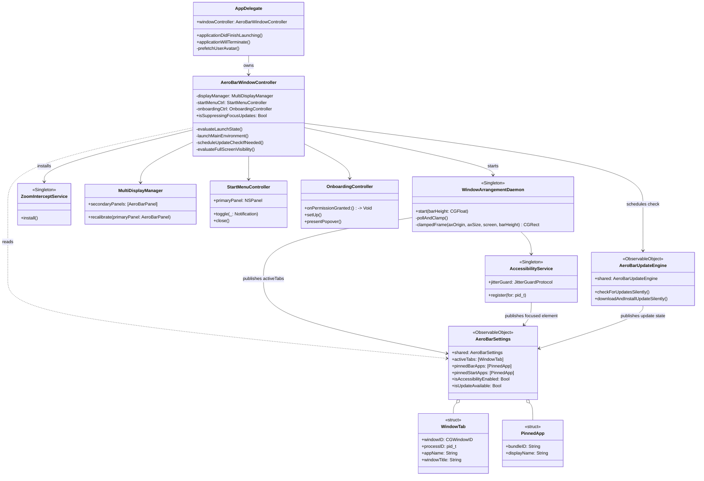
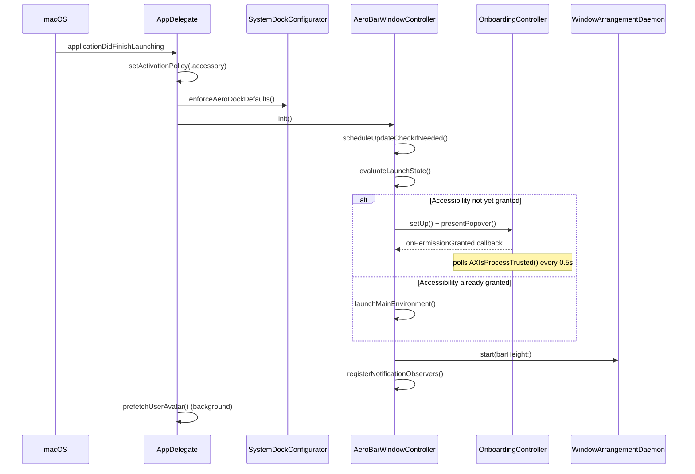
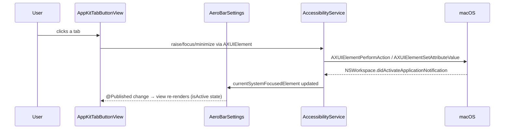

# AeroBar Architecture

This document covers how AeroBar is put together: the folder layout, the
object/class relationships, how data flows through the app, and what happens
during launch and during a normal window-switch. It's meant for anyone
picking up the codebase cold.

## Project layout

```
AeroBar/
├── Core/
│   ├── AeroBarApp.swift          # @main entry point (SwiftUI App shell)
│   ├── AppDelegate.swift         # NSApplicationDelegate — launch/terminate hooks
│   ├── Models/                   # Plain data types (WindowTab, PinnedApp, ...)
│   ├── Services/                 # Long-lived singletons doing the real work
│   └── Utilities/                # Stateless helpers (Color hex, Dock defaults)
├── Window/                       # NSPanel/NSWindowController layer (AppKit)
├── Views/
│   ├── Bar/                      # Root taskbar SwiftUI view
│   ├── StartMenu/                # Start Menu SwiftUI views
│   ├── Subviews/                 # Bar components (tabs, pinned tray, search...)
│   ├── Settings/                 # Settings & update-alert SwiftUI views
│   ├── Customizer/                # Appearance Lab SwiftUI views
│   └── AppKitBridges/             # NSViewRepresentable wrappers (blur, noise)
└── AeroBarTests/                 # XCTest targets
```

The rule of thumb used throughout: **Window/** owns AppKit panels and
lifecycle, **Views/** is pure SwiftUI with no side effects, and
**Core/Services/** is where state actually lives and changes.

## Class diagram

The diagram below covers the main runtime objects and how they reference
each other. `AeroBarSettings` is the hub — almost everything either reads
from it or writes to it.



## Data flow (DFD)

This is the level-0 data-flow view: where state comes from, where it's
stored, and what reads it back out.

```mermaid
flowchart LR
    subgraph OS["macOS"]
        AX[Accessibility API]
        SC[ScreenCaptureKit]
        WS[NSWorkspace notifications]
        GH[(GitHub Releases API)]
        SP[Spotlight / NSMetadataQuery]
    end

    subgraph Services["Core/Services"]
        WAD[WindowArrangementDaemon]
        ACS[AccessibilityService]
        UPD[AeroBarUpdateEngine]
        SPS[SpotlightService]
        PAS[PinnedAppsService]
    end

    STORE[(AeroBarSettings\n@Published state)]
    DEFAULTS[(UserDefaults /\nAppStorage)]

    subgraph UI["SwiftUI Views"]
        BAR[AeroBarMainContainerView]
        START[AeroStartMenuView]
        PREVIEW[UniversalWindowPreviewChip]
        SETTINGS[AeroBarSettingsView]
    end

    AX --> WAD
    AX --> ACS
    WS --> ACS
    SC --> PREVIEW
    GH --> UPD
    SP --> SPS

    WAD -- activeTabs --> STORE
    ACS -- focused element --> STORE
    UPD -- update flags --> STORE
    SPS -- indexedLocalApps --> STORE
    PAS <-- pinned lists --> DEFAULTS
    STORE <-- pinned lists --> PAS

    STORE --> BAR
    STORE --> START
    STORE --> SETTINGS
    BAR --> PREVIEW

    SETTINGS -- writes prefs --> DEFAULTS
```

Key point: **AeroBarSettings is the only thing UI views read from.** No view
talks to a Service directly for state — services publish into Settings, and
views subscribe to Settings. The exceptions are fire-and-forget actions (e.g.
a button calling `AeroBarUpdateEngine.shared.downloadAndInstallUpdateSilently()`
directly), which only write, never read back synchronously.

## Process flow: app launch



## Process flow: switching a window from the taskbar



## Why a few things are structured the way they are

- **One `AeroBarSettings` instead of many small published stores** — most
  state in this app is genuinely cross-cutting (the Start Menu, the bar, and
  the Settings popover all care about pinned apps, for example), so a single
  observable hub avoids a tangle of `EnvironmentObject` wiring between
  unrelated views.
- **`WindowArrangementDaemon` polls instead of purely observing AX
  notifications** — AXObserver callbacks are unreliable for some third-party
  apps that don't post the expected notifications, so a 100ms poll is the
  fallback that actually works across the apps people use day to day.
- **`ZoomInterceptService` exists separately from the daemon** — the daemon's
  poll loop can only correct a window's frame *after* the macOS zoom
  animation finishes, which is visibly late. The intercept service pre-clamps
  the frame before the animation starts, using a CGEvent tap on the title-bar
  click.
